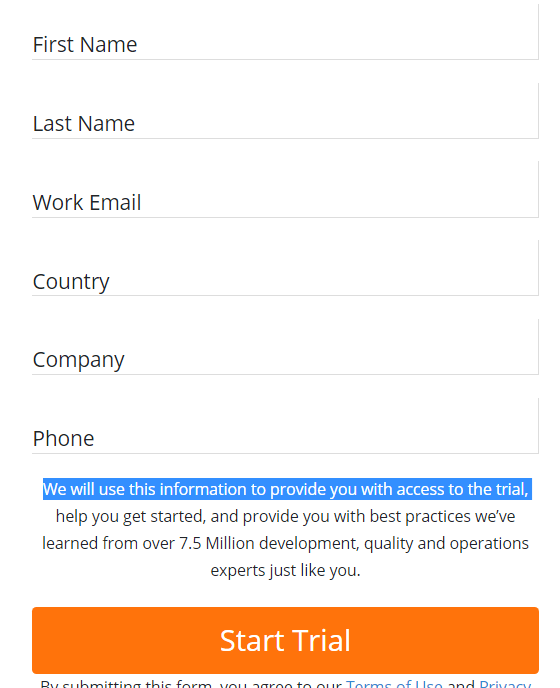
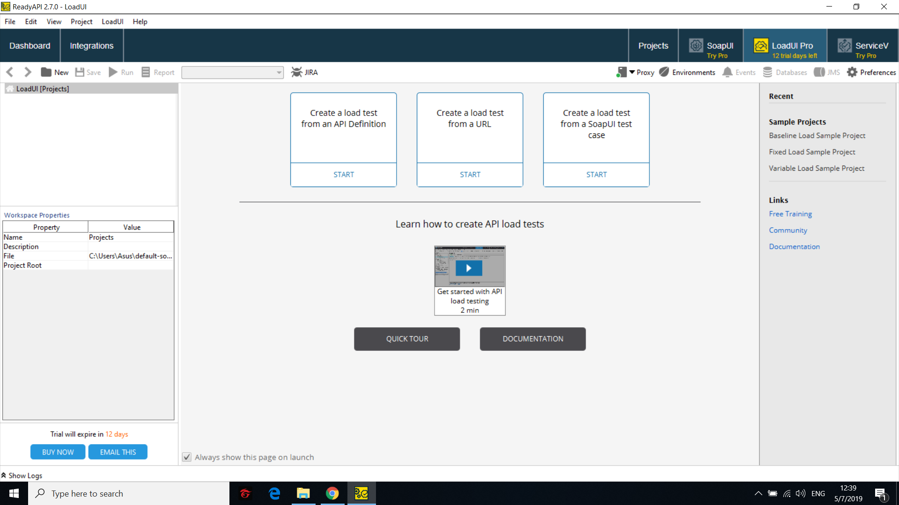
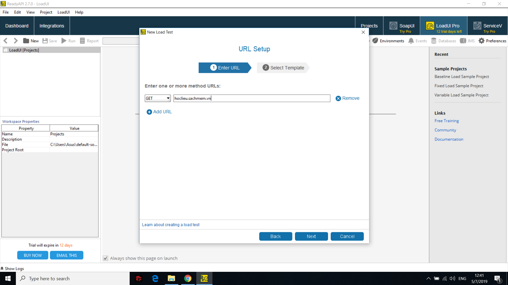
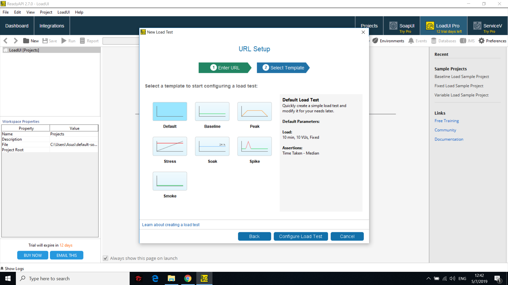
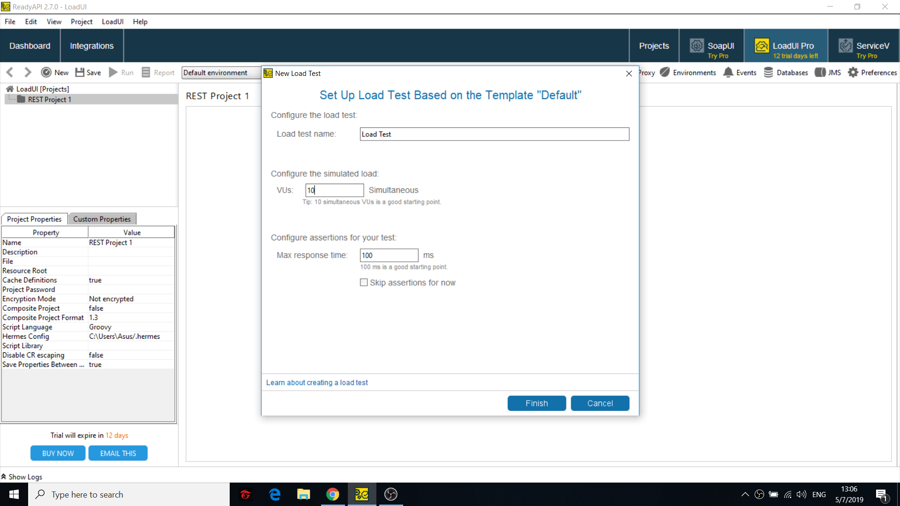
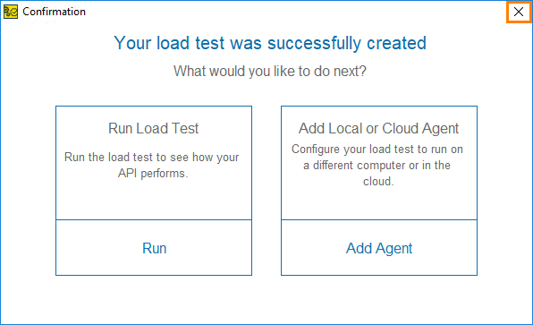
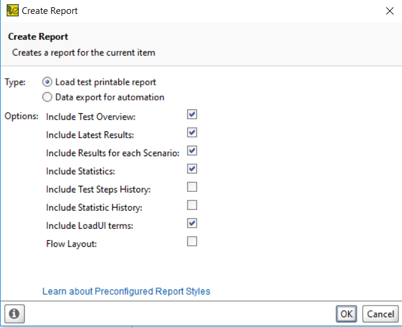
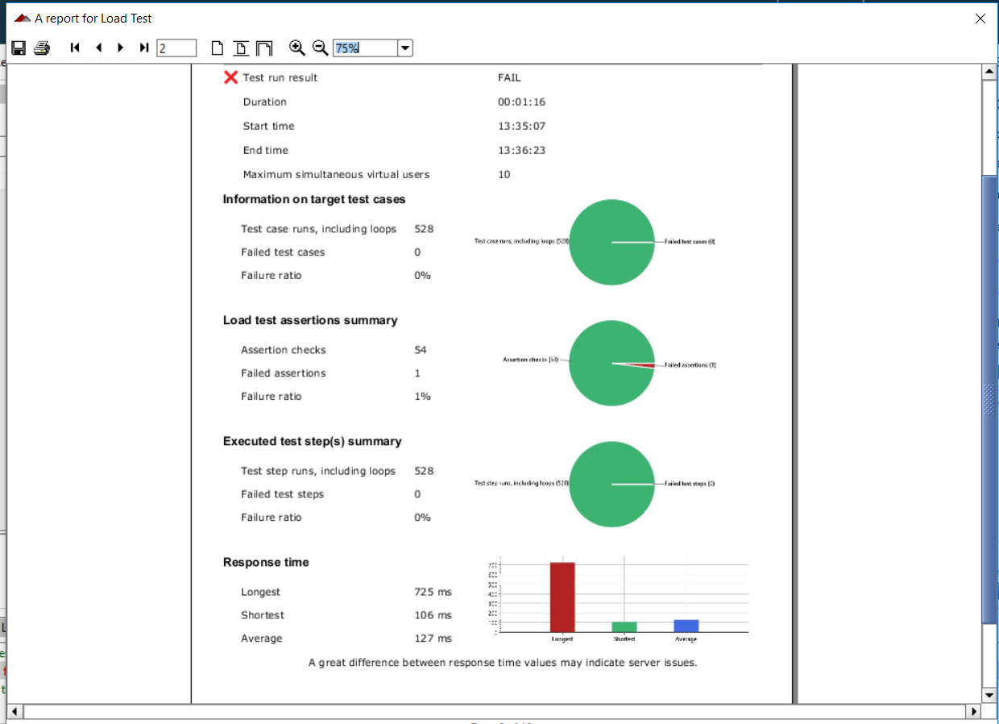
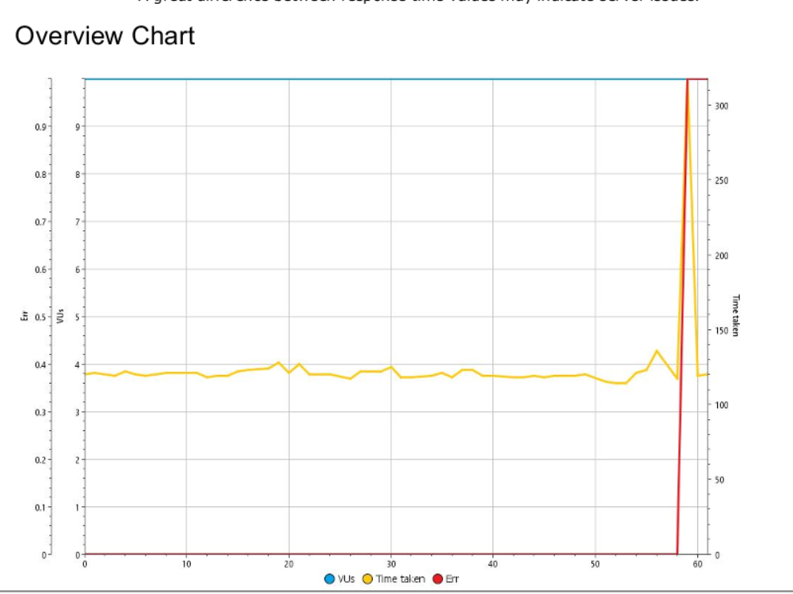

# Hướng dẫn  sử dụng LoadUI Pro

Video hướng dẫn: https://youtu.be/<br>

## 1. Giới thiệu công cụ
LoadUI Pro là một ứng dụng kiểm thử tải API. Với giao diện trực quan kéo và thả, nó cho phép bạn tạo, cấu hình thử nghiệm và điều phối tương tác kiểm thử tải của bạn trong thời gian thực.
LoadUI Pro hỗ trợ tất cả các giao thức chuẩn từ REST, SOAP/WSDL, AMF, JDBC, POX to HTTP(S) and HTML…

Trong một môi trường thử nghiệm, LoadUI cung cấp bản thử nghiệm hoàn chỉnh, bao gồm kiểm thử tải mạng, kiểm thử tự động, stress test và nhiều tính năng khác.

## 2. Cài đặt 
### Bước 1. Đăng ký bản dùng thử của LoadUI Pro tại :
```
https://smartbear.com/product/ready-api/loadui/free-trial/
```

### Trình duyện sẽ tự động tải về sau khi bạn đăng ký
### Bước 2. Chạy file vừa tải về và cài đặt
## 3. Hướng dẫn sử dụng
### Bước 1. Mở ứng dụng LoadUI Pro vừa cài đặt
### Bước 2. Chọn dạng LoadTest muốn sử dụng

Có 3 lựa chọn có thể chọn:
- Create a loadtest from API Definition : tạo testcase từ API
- Create a loadtest from a URL : tạo testcase từ URL trang web
- Create a loadtest from a SOAPUI Testcase : tạo testcase từ SOAPUI Testcase
Ở đây mình tạo testcase thông qua URL của  trang hoclieu,sachmem.vn


### Bước 3.  Chọn template phù hợp

- Default: Template mặc định,tùy chỉnh
- Baseline: Kiểm thử hiệu năng hệ thống dưới mức tải mong đợi và tạo đường cơ sở cho các testcase sau
- Peak: Kiêm thử tạo ra testcase tải tăng đột ngột
- Stress: Kiểm thử tìm mức tải khiến hệ thống bị crash
- Soak: Kiểm thử với thời gian dài
Ở đây chúng ta chọn Default.

### Bước 4. Thiết lập các giá trị


## Bước 5. Chạy LoadTest


## Bước 6. Lấy báo cáo kết quả

Chọn Report để tạo Report kết quả

Báo cáo Kiểm Thử

## 4. Kết quả kiểm thử trên hoclieu.sachmem.vn
Có 1 vài trường hợp vượt quá thời gian phản hồi mong đợi

